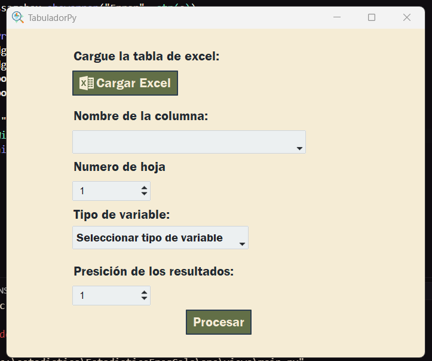
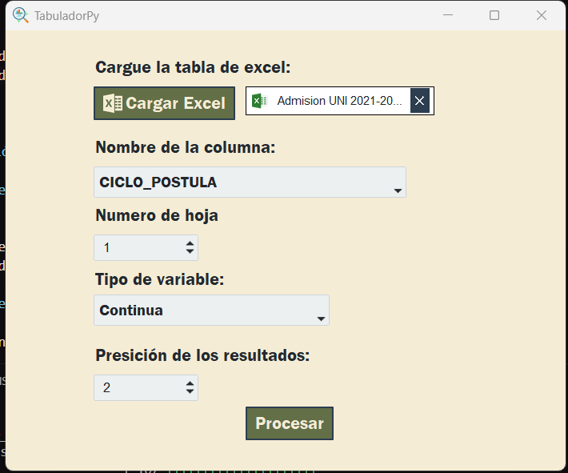
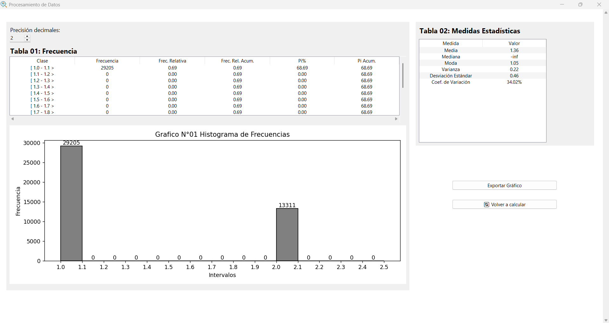

# 📊 Programa de Cálculo de Frecuencias

Programa desarrollado usando el lenguaje de programación Python, junto con las librerías NumPy, Pandas y Matplotlib.

Tiene como propósito servir de ayuda en el análisis de grandes volúmenes de datos.

---

## 📑 Tabla de Contenido

- [📊 Programa de Cálculo de Frecuencias](#-programa-de-cálculo-de-frecuencias)
  - [📑 Tabla de Contenido](#-tabla-de-contenido)
  - [📚 Descripción](#-descripción)
  - [📁 Estructura del Proyecto](#-estructura-del-proyecto)
  - [📸 Demo](#-demo)
  - [🚀 Instalación](#-instalación)
    - [Programas requeridos](#programas-requeridos)
    - [Librerías necesarias](#librerías-necesarias)
  - [📝 Guía de Uso](#-guía-de-uso)
  - [🤝 Contribuidores](#-contribuidores)
  - [📄 Licencia](#-licencia)

---

## 📚 Descripción

El programa fue desarrollado como proyecto para el curso de *Estadística 2025-I*.  
Tiene el propósito de calcular las tablas de frecuencias de un conjunto de datos junto con sus respectivas medidas de tendencia central (si es que los datos ingresados son cuantitativos).

---

## 📁 Estructura del Proyecto

```bash
EstadisticaFreqCalc/
├── assets/                                     # Recursos gráficos y archivos auxiliares
├── src/                                        # Código fuente principal del programa
│   ├── calcs/
│   │   ├── cuantitative_grouped_data.py        # Calculos de frecuencias y medidas de resumen para datos agrupados en intervalos
│   │   ├── cuantitative_no_grouped_data.py     # Calculos de frecuencias y medidas de resumen para datos no agrupados
│   │   └── manager_calcs.py                    # Importacion de datos y seleccion de tipo
│   ├── views/
│   │   ├── main.py                             # Script principal de ejecución
│   │   └── results.py                          # Ventana de visualizacion de resultados
│   ├── exception_handler.py                    # Archivo de Excepciones personalizadas
│   └── path_manager.py                         # Archivo para la obtencion de rutas absolutas
├── .gitignore                                  # Archivos y carpetas ignorados por Git
├── LICENSE                                     # Licencia del proyecto (GPL-3.0)
└── README.md                                   # Documentación del proyecto
```

---

## 📸 Demo





---

## 🚀 Instalación

### Programas requeridos

1. Un editor de código como VSCode.
2. El sistema de control de versiones Git.
3. El lenguaje de programación Python 3.12.X.

### Librerías necesarias

Asegúrate de tener instaladas las siguientes librerías:

- NumPy 2.2.5
- Pandas 2.2.3
- Matplotlib 3.10.1
- python-calamine
- polars
- openpyxl
- ttkbootstrap
- PIL

Puedes instalarlas utilizando el siguiente comando:

```bash
pip install numpy==2.2.5 pandas==2.2.3 matplotlib==3.10.1 python-calamine polars openpyxl ttkbootstrap PIL
```

---

## 📝 Guía de Uso

1. Clona el repositorio:

```bash
git clone https://github.com/JunixOs/EstadisticaFreqCalc.git
cd EstadisticaFreqCalc
```

2. Ejecuta el script principal:

```bash
python src/main.py
```

3. Sigue las instrucciones en pantalla para ingresar tus datos.

4. El programa generará:

   - Tabla de frecuencias.
   - Medidas de tendencia central (media, mediana y moda).
   - Gráficos representativos utilizando Matplotlib.

---

## 🤝 Contribuidores

Este proyecto fue desarrollado por el equipo de Estadística.

¡Las contribuciones son bienvenidas! Si deseas mejorar este proyecto, por favor sigue estos pasos:

1. Haz un fork del repositorio.
2. Crea una nueva rama: `git checkout -b feature/nueva-funcionalidad`.
3. Realiza tus cambios y haz commit: `git commit -m 'Agrega nueva funcionalidad'`.
4. Sube tus cambios: `git push origin feature/nueva-funcionalidad`.
5. Abre un Pull Request.

---

## 📄 Licencia

Este proyecto está licenciado bajo la Licencia Pública General GNU v3.0. Consulta el archivo [LICENSE](LICENSE) para más detalles.

